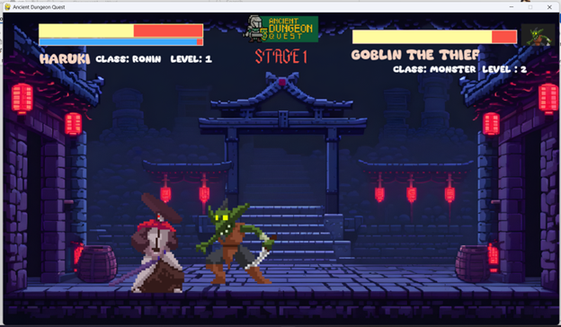
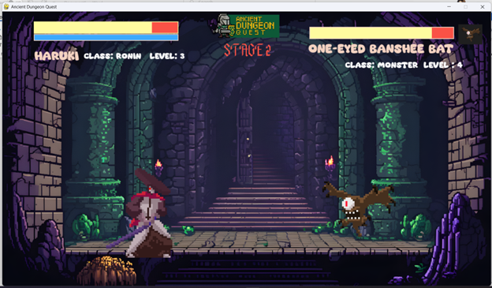
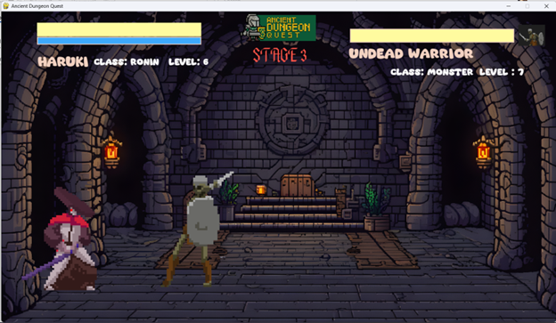
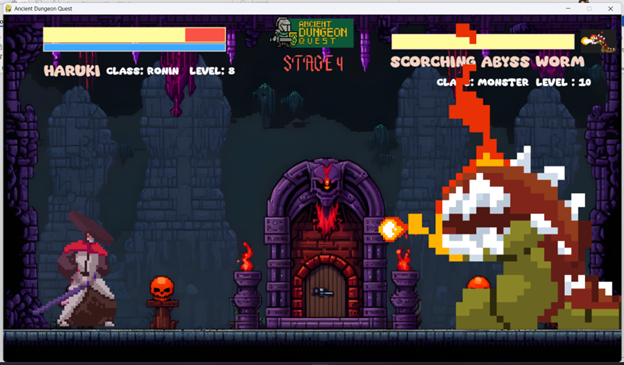
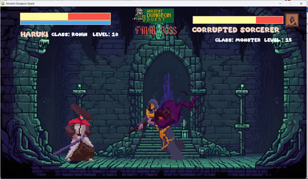
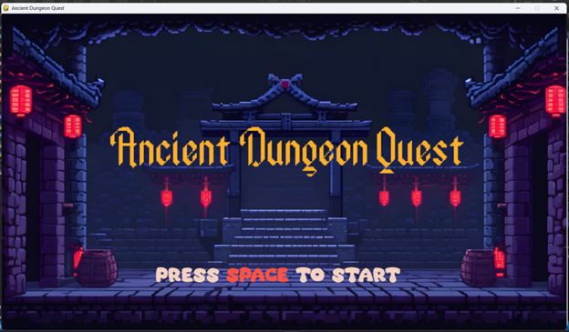
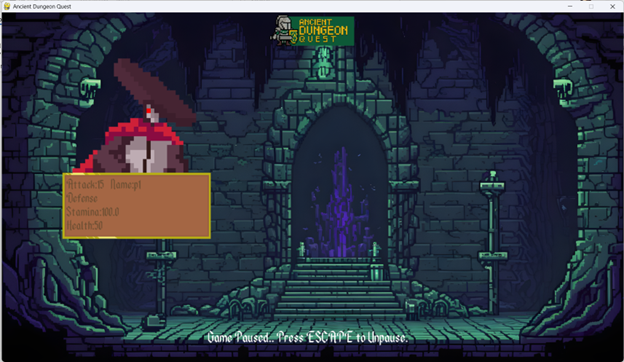

# 🏰 Ancient Dungeon Quest

> A thrilling 2D dungeon escape game built with Python and Pygame.  
Fight your way through dangerous enemies, master your skills, and survive the depths of an ancient dungeon.

## 🧠 Technical Overview

### 🐍 Programming Language
This game is developed using **Python**, a powerful and beginner-friendly programming language widely used for game development, automation, and software engineering.

---

### 🎮 Game Engine / Library
The game is built using **Pygame**, a Python library designed for creating 2D games.

Pygame handles:
- 🎨 Graphics rendering (images, animations)
- ⌨️ User input (keyboard and mouse)
- 🔊 Sound effects and background music
- 🔄 Game loop and event handling
- 💥 Collision detection

---

### 📦 Imports Used

#### 🔹 Core Libraries
```python
import pygame
import random

---

## 🎮 How to Play

1. Open the project folder  
2. Double-click **`Ancient Dungeon Quest.exe`**  
3. Choose your character and begin your adventure!

> ⚠️ Make sure the `assets` folder is in the same directory as the `.exe` file.

---

## 🧙‍♂️ Game Features

- ⚔️ Two playable characters (Samurai & Warrior)
- 🧠 Progressive enemy difficulty
- 🎯 Unique mechanics per stage
- 🔥 Boss fights with special strategies
- 🎵 Immersive sound effects and background music
- ⏸️ Pause system and retry mechanics

---

## 🗺️ Game Stages

### 🟢 Stage 1 – Goblin Encounter
A basic introduction to combat. Fight a sneaky goblin and learn movement and attack mechanics.



---

### 🟢 Stage 2 – Flying Terror
A fast-moving flying enemy appears. Timing and positioning become more important.



---

### 🟢 Stage 3 – Undead Warrior
A stronger enemy with better endurance. Prepare for longer fights and smarter attacks.



---

### 🔥 Stage 4 – Scorching Abyss Worm (Boss)
A powerful worm that **cannot be damaged by normal attacks**.

👉 **Mechanic:**  
You must **reflect the fireball back to the worm** to deal damage.

- Dodge incoming fireballs  
- Attack at the right time to reflect them  
- Use strategy instead of brute force  



---

### 🔴 Stage 5 – Final Boss: Corrupted Sorcerer
The ultimate challenge. A powerful sorcerer with deadly attacks awaits.



---

## 🧍 Character Selection

### 🥷 Samurai
Fast and agile with balanced attacks.

.png)

---

### 🛡️ Warrior
Stronger attacks but slightly slower movement.

.png)

---

## 🎬 Game Screens

### ▶️ Start Screen


### ⏸️ Pause Menu


### 💀 Player Defeated
.png)

---

## 🏆 Victory Screens

Each stage has a completion screen after defeating enemies.

Example:

.png)  
.png)  
.png)  
.png)  
.png)  

---

## 🛠️ Built With

- Python 🐍
- Pygame 🎮

---

## 📂 Project Structure
